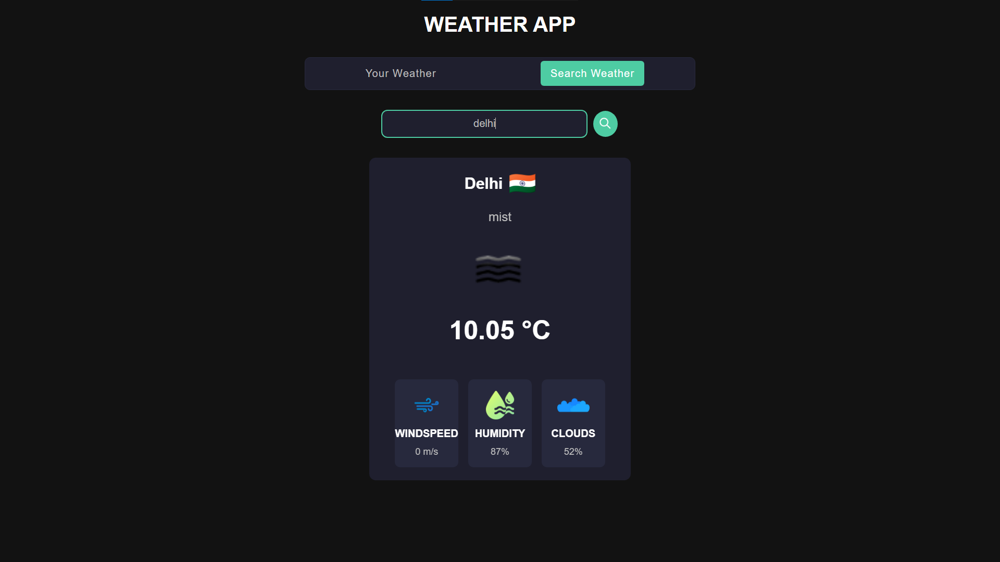
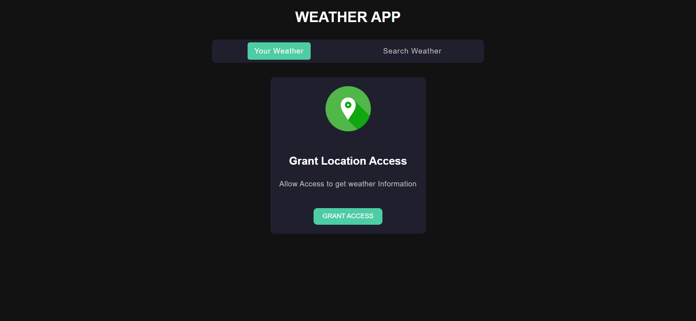

# Weather App 🌦️

A dynamic weather application built with HTML, CSS, and JavaScript that provides real-time weather updates. The app fetches weather information based on the user's current location or a searched city using the OpenWeatherMap API.

---

## Features ✨

- **Fetch Current Location Weather**: Automatically fetches and displays weather information based on the user's current location using geolocation.
- **City Search Functionality**: Allows users to search for weather data by entering the name of a city.
- **Real-Time Weather Updates**: Displays up-to-date weather details including temperature, wind speed, humidity, cloudiness, and a weather icon.
- **Interactive UI**: Includes tabs for switching between "Your Weather" and "Search Weather" views.
- **Responsive Design**: Optimized for different devices, ensuring a seamless user experience.
- **Session Storage Integration**: Stores user location data for a more personalized experience.

---

## Screenshots 📸

---

## Technologies Used 🛠️

- **Frontend**: HTML, CSS, JavaScript
- **API**: [OpenWeatherMap API](https://openweathermap.org/api)
- **Storage**: Session Storage

---

